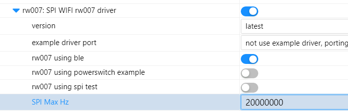
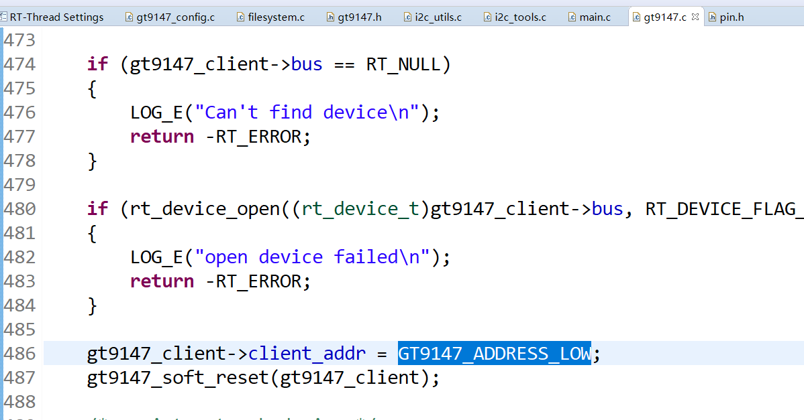
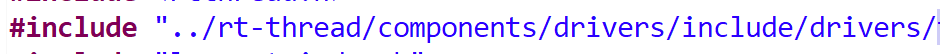
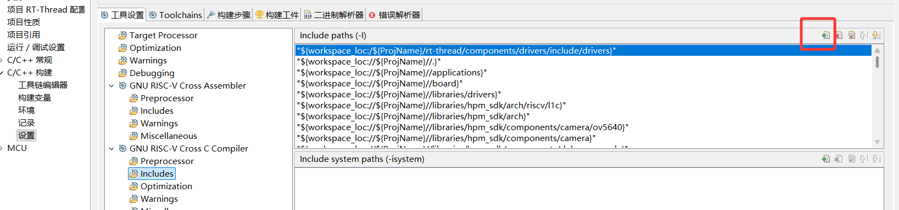

# RTT-BSP

​	这个工程是在hpm6750evk2的基础上修改的,使用rtthread studio导入。

​	硬件的部分可以参考立创开源广场的链接[基于HPM6750的lambda-pi - 立创开源硬件平台](https://oshwhub.com/zhaowenbin/lambda-pi)

## 主要修改

​	sd卡增加了插拔检测，文件系统可以动态挂载和移除sd卡。

​	touch触摸使用了gt9147的软件包，增加了debug选项，可以再msh中输出touch相关的调试信息。

​	cam增加了一个example的例程，可以使用msh启动，在使用了默认的squareline生成的ui文件可以采集图片显示出来。

​	jpeg暂时只有解码器，增加了几个函数，可以读取sd卡的jpeg图像输出成lvgl使用的格式，还有对应的释放内存的函数。

​	调整了board的文件夹结构，调整了kconfig的设置。

​	修改了flash_sdram_rtt.ld文件以支持64M的sdram。

### 未完成事项

​	lvgl的custom gpu部分还有问题，注册decode设备也还未完成。

## 外设驱动_板载

### sdxc

​	sdc0因为使用spi1连接rw007，无法使用，此处删掉

​	vsel引脚是pd29

### lcd

​	这部分暂时只写了正点原子4.3寸rgb，800*480的屏幕，其他的需要自己适配一下

​	panel参数可以看下面的注意部分

### touch

​	正点原子4.3寸rgb，800*480的屏幕用的是gt9147,使用rtt的gt9147的驱动

​	添加了debug选项，会在控制台输出调试信息，还有有触摸信息（单点）

​	需要修改PKG的一些东西，见下面注意部分

​	**正点原子有点的用的有些不是gt9147！！！他那个触摸时好时坏，十分坑**

### cam

​	rst是DRG模块自己上电使能，这里只有pwr引脚要控制

### i2c

​	i2c0没有引出，连接了板载的at24c02和摄像头接口

​	i2c1与cam引脚冲突，但是引脚引出了，不用cam时候可以用,pa10 11

​	i2c2所有引脚情况都无法使用，这里就删掉了

​	i2c3引出了，对应pb13.14

### spi

​	spi0引脚和cam冲突，但是引出来了，不用cam可以用。可以四线

​	spi1连接rw007，没有引出

​	spi2引出来了，单线没问题，四线的dat2和eth1的默认resrt引脚冲突，可以自己手动改一下。可以四线

​	spi3全没引出，删掉

​	pinmux里面配置的都是单线，如果要用其他的需要自己改一下

### uart

​	串口有点多，默认uart0连了hslink

​	uart1，5，13有gpio引出

​	uart2和eth1冲突，pe16，pe21

​	其他的没仔细看，太多了

### femc-sdram

​	硬件上没什么问题，但他工程选内存算法时候发现他手动排除了内存算法，所以换内存算法时候需要注意。然后就是我选择的ld文件经过了修改，拿的flash-sdram-rtt.ld，内存大小改成64m，heap改成了40m。

### rw007

​	需要使用spi1和pe0和pe1

​	然后需要手动去软件包弄成这样



## 外设驱动_扩展

### can

​	can0有引出，默认pb15，17

​	can1，2，3引脚没有冲突，也引出来了

### eth

​	eth的引脚和6750evk2使用的是一样的，eth0引脚冲突，只能用eth1

​	sdk的components里面支持的phy很多，可以自己看一下

### audio

​	i2s0，dao和pdm0引脚与hpm6750evk2相同

# 注意

​	sdxc1在1.0版本硬件没有pwr的功能，1.1版本的硬件会使用pf01作为pwr引脚,可以短接排针和电阻电容之间的连接处。

## rtt

​	如果后面跟着hpm的evk升级rtt-driver，driver部分不适合改动太大，这里列出了修改的地方

### sdcard

​	sd卡检测插拔修改了drv_sdio，增加了下面这个函数,用于插拔检测

```c
void hpm_mmcsd_change(void)
{
    mmcsd_change(s_hpm_sdxc1.host);
}
```

### touch

​	经过测量，在上电没初始化的阶段，int脚是低电平，但是地址并不是0x5d（7bit），很奇怪i2c的地址是0x14（在rtt中，i2c写的是7bit地址。如果是8bit地址是0x28/0x29），gt9147默认的地址是GT9147_ADDRESS_HIGH（0x5d），这个是错的，需要手动改成GT9147_ADDRESS_LOW，在gt9147.c的init里



​	然后就是使用gt9147的软件包编译时候会提示找不到touch.h，好像是5.0x版本之后rtt的文件结构变了。有几个办法，如果是用rtthread studio可以手动把这里添加





​	还有就是原来用#include touch.h的改成#include "drivers/touch.h"

​	touch是支持多点的，但是lvgl里面只用了一个点，可以修改touch_thread_entry里面的代码从而支持多点

​	使用正点的屏幕可能会碰到屏幕id是1154的，这种用着时好时坏

## hpm-sdk

​	用hpm-sdk的话，增加屏幕需要改动的地方比较多，如果后面跟着sdk升级，再改有些麻烦，这里就偷懒的改了

### panel

​	sdk->component->panel->panels->tm070rdh13.c被修改了，经过测试，里面面板参数.pixel_clock_khz = 600000改成400000就可以用在正点的800*480，rgb接口4.3寸的屏了。

### jpeg

​	修改了hpm_sdk->components->SConscript,增加了jpeg导入

```python
if GetDepend(['BSP_LVGL_JPEG_SUPPORT']):
	src += [os.path.join(cwd, 'jpeg', 'hpm_jpeg.c') ]
	path += [ os.path.join(cwd, 'jpeg') ]
```

# 待解决的问题

​	sd卡硬件有些问题，无法使用SDR104，会在后面的硬件版本修改
